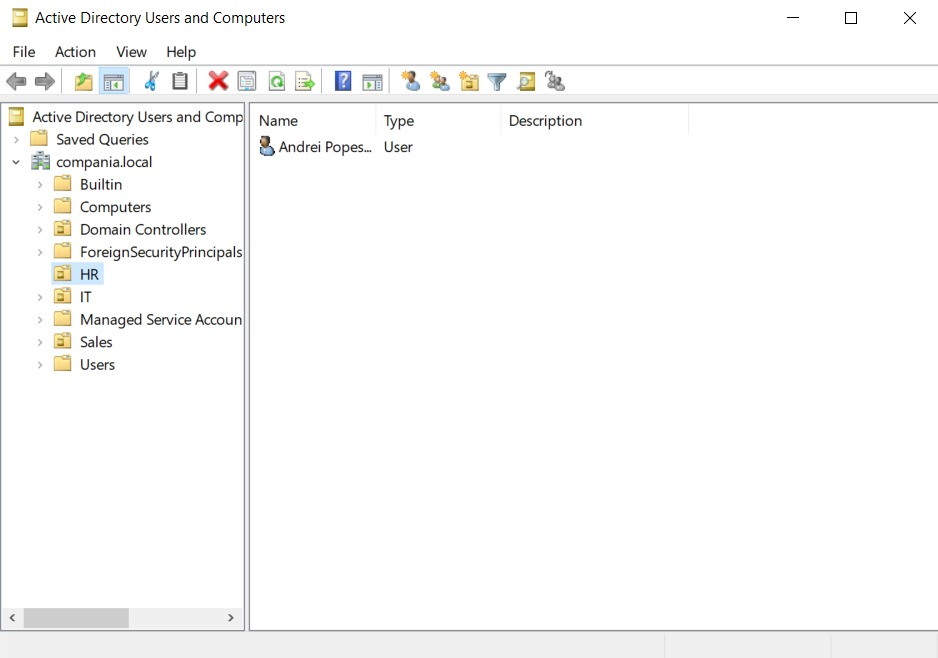
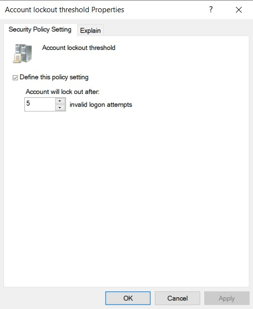
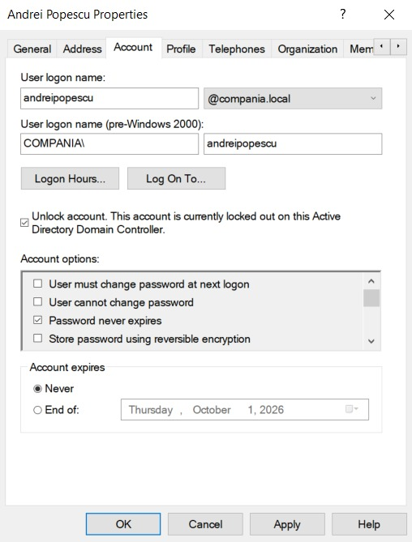
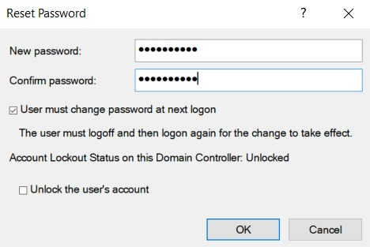
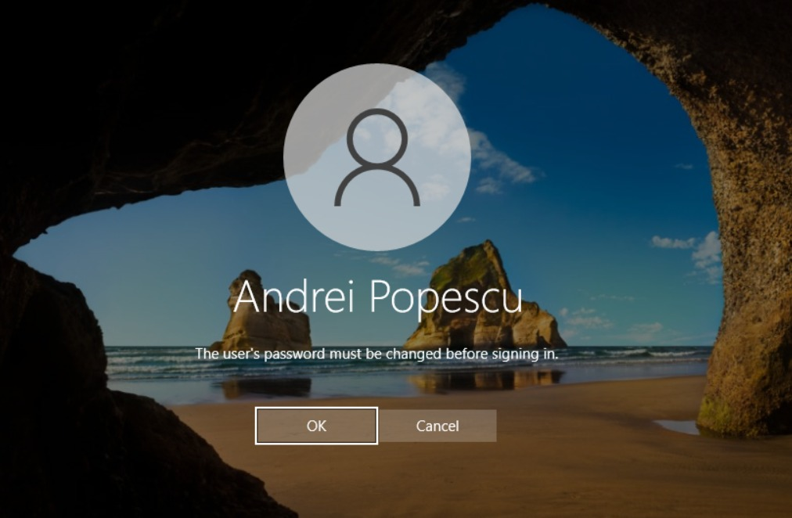
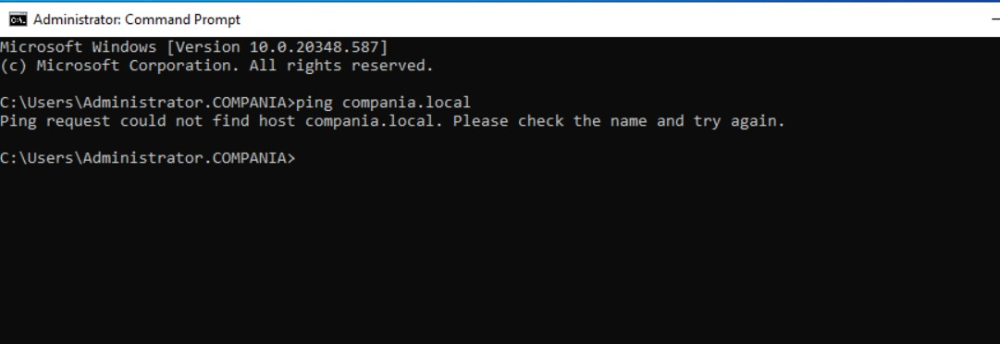
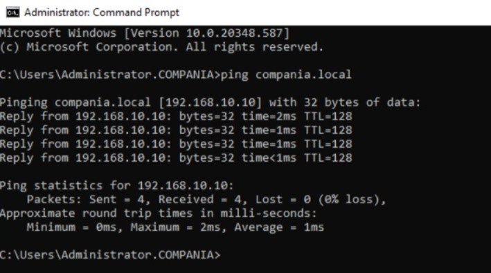
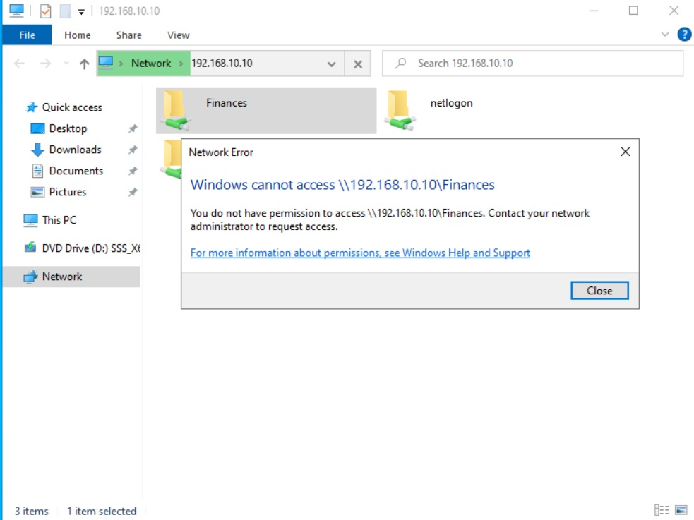
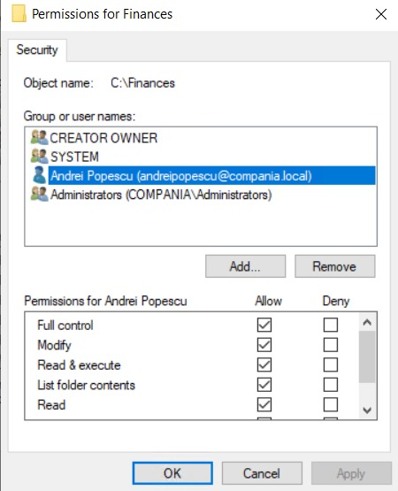
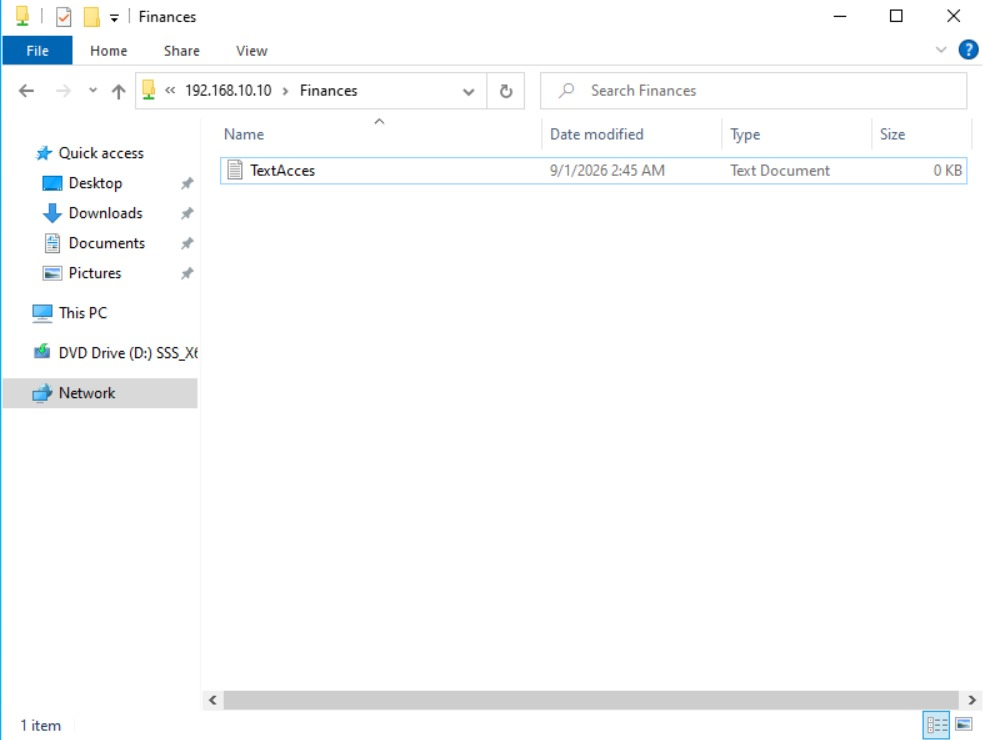

# Windows-Server-Helpdesk-Homelab

**Environment:** Windows Server 2022, Hyper-V, Windows 10/11 Enterprise  
**Domain:** compania.local

This repository documents practical scenarios I built in my personal homelab to simulate daily Tier 1 & Tier 2 IT Support tasks, demonstrating my ability to troubleshoot user issues, manage Active Directory, and maintain network security and permissions.

---

## 📁 Project 1: Ticket Simulation - Account Lockout & Password Reset

### 📝 Ticket Details
*   **User Issue:** Andrei Popescu from the HR department reports that he cannot log into his computer. He receives an error stating his account is locked.
*   **Root Cause:** The account was locked after multiple failed authentication attempts, in accordance with the domain's account lockout policy.
*   **Resolution:** Verify the block in Active Directory, unlock the account, assign a temporary password, and enforce a mandatory password change upon the user's next login to maintain security.

### Step 1: The Active Directory Environment
Before handling the ticket, I set up the foundation of the domain. I created the Organizational Units (OUs) for different departments and added the domain users to keep the network structured and easy to manage.

### Step 2: The Security Policy (GPO)
To protect the company network from brute-force attacks, a Group Policy Object (GPO) is active on the server. I configured the **Account lockout threshold** to 5 invalid logon attempts.

### Step 3: Reproducing the User Error
On the client machine, I simulated the incident by intentionally typing the wrong password 5 times. The system worked as intended and blocked access, displaying the exact error the user reported in the ticket: *"The referenced account is currently locked out and may not be logged on to."*

### Step 4: Troubleshooting and Unlocking the Account
To resolve the issue, I logged into the Domain Controller and opened **Active Directory Users and Computers (ADUC)**. I located Andrei's account, opened the properties, and confirmed the account was indeed locked. I checked the **Unlock account** box to restore his access.

### Step 5: Resetting the Password Securely
Since Andrei forgot his original password, I needed to provide a new one. I used the **Reset Password** feature to assign a temporary password. Following IT security best practices, I checked the box *"User must change password at next logon"*. This ensures the Helpdesk does not know the user's private password.

### Step 6: Ticket Resolved & Security Enforced
Back on the client machine, Andrei logs in using the temporary password I provided. Immediately, Windows prompts him with the message: *"The user's password must be changed before signing in."* The user sets a new, private password, successfully regaining access to his workstation. The ticket is now closed.

---

## 📁 Project 2: Ticket Simulation - Network Connectivity & DNS Troubleshooting

### 📝 Ticket Details
*   **User Issue:** A user reports that they cannot access the company intranet, shared network drives, or log into certain domain services.
*   **Root Cause:** The client machine lost connection to the Domain Controller because its IPv4 DNS settings were incorrectly altered (pointing to an external DNS instead of the internal server).
*   **Resolution:** Diagnose the connectivity issue using Command Prompt, reconfigure the network adapter to point to the correct internal DNS server (192.168.10.10), and verify that domain communication is restored.

### Step 1: Diagnosing the Connection Issue
To understand why the client machine cannot reach the domain, I opened Command Prompt on the affected workstation and used the `ping` utility to test connectivity to the domain name (`compania.local`). 
*   **Result:** The hostname compania.local could not be resolved to an IP address. This indicated a DNS resolution problem, so I proceeded to verify the client's DNS configuration.

### Step 2: Fixing the Network Adapter Settings
Knowing it's a DNS issue, I opened the Network Connections panel (`ncpa.cpl`) on the client machine and accessed the IPv4 properties of the network adapter. 
*   **Action:** I noticed the Preferred DNS server was incorrectly set. I removed the wrong IP and inputted the correct IP address of the internal Domain Controller / DNS Server (`192.168.10.10`). I then saved the changes.

### Step 3: Verifying the Resolution
After correcting the DNS settings, I returned to Command Prompt to verify if the issue was resolved. I ran the `ping compania.local` command once again.
*   **Result:** The command successfully resolved the domain name to the server's IP and received 4 perfect replies (0% packet loss). The workstation is now properly communicating with the domain, and the ticket is closed.

---

## 📁 Project 3: Ticket Simulation - Shared Folder & NTFS Permissions

### 📝 Ticket Details
*   **User Issue:** Andrei Popescu reports that he cannot open the Finance department's shared network drive to upload his documents.
*   **Root Cause:** The user's Active Directory account did not have the required NTFS permissions to access and modify the `Finances` folder.
*   **Resolution:** Modify the folder's security properties on the server to grant the user explicit rights, then verify the read/write access from the client workstation.

### Step 1: Reproducing the Access Denied Error
On the client machine, I navigated to the network path `\\192.168.10.10\Finances`. 
*   **Result:** Windows immediately blocked access, displaying the standard *"You do not have permission to access..."* prompt. This validates the user's initial complaint.

### Step 2: Modifying NTFS Permissions on the Server
To grant the necessary rights, I logged into the server holding the shared files. I right-clicked the `Finances` folder, navigated to Properties, and opened the **Security** tab.
*   **Action:** I modified the NTFS permissions on the Finances folder to grant Andrei the required access. For this lab, I assigned the permissions directly to the user account to simulate the ticket resolution. I granted the user **Modify** permissions, which allowed him to read, create, modify, and delete files within the folder.

### Step 3: Validating the Fix
I returned to the client workstation and attempted to access the network path again.
*   **Result:** The `Finances` folder opened instantly without any errors. To ensure the user had full write access, I created a new text file named `TextAcces.txt`. The file creation was successful, confirming the ticket is completely resolved.

---

## 🛠️ Skills Demonstrated
*   **Active Directory User Administration**
*   **Account Lockout & Password Reset**
*   **Group Policy (GPO)**
*   **DNS Troubleshooting**
*   **IPv4 Configuration**
*   **Network Connectivity Troubleshooting**
*   **NTFS Permissions**
*   **Windows Server 2022**
*   **Windows 10/11 Administration**
*   **Hyper-V Virtualization**
